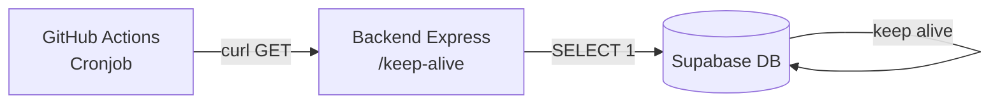

# Supabase Keep-Alive Cronjob — Design Doc

## Problem

Supabase free tier secara otomatis mem-pause database jika tidak ada aktivitas (query) selama 7 hari. Karena project ini menggunakan free plan, diperlukan mekanisme untuk mencegah pause tersebut dengan secara periodik melakukan request ke backend yang memicu koneksi database.

## Solution

GitHub Actions cronjob yang secara terjadwal melakukan HTTP request ke endpoint keep-alive di backend Express.

## Arsitektur

## Komponen

### 1. Backend Endpoint (dibuat user di repo backend)

- **Method:** GET
- **Path:** `/keep-alive` (bisa disesuaikan)
- **Fungsi:** Melakukan query ringan ke database, misal `SELECT 1` atau query kecil lain
- **Response:** `{ "status": "ok", "timestamp": "..." }`

### 2. GitHub Actions Workflow (dibuat di repo ini)

- **File:** `.github/workflows/supabase-keep-alive.yml`
- **Trigger:** Cron schedule
- **Schedule:** Senin jam 08:00 & Kamis jam 08:00 WIB
- **Action:** `curl` ke endpoint backend
- **Secret:** `BACKEND_URL` — disimpan di GitHub Secrets

## Schedule Detail

| Hari | Waktu | Cron Expression |
|------|-------|----------------|
| Senin | 08:00 WIB (01:00 UTC) | `0 1 * * 1` |
| Kamis | 08:00 WIB (01:00 UTC) | `0 1 * * 4` |

Catatan: WIB = UTC+7, jadi jam 08:00 WIB = 01:00 UTC.

## Environment Variables (GitHub Secrets)

| Secret | Value | Keterangan |
|--------|-------|------------|
| `BACKEND_URL` | `https://express-k-nekt-be-lilac.vercel.app` | Base URL backend tanpa `/v1` |

## Workflow Steps

1. Trigger cron sesuai schedule
2. `curl` ke `${{ secrets.BACKEND_URL }}/v1/keep-alive`
3. Log HTTP response status dan body
4. Jika gagal (non-2xx), workflow marked as failed

## Error Handling

- Workflow akan failure jika response code bukan 2xx
- GitHub akan kirim notifikasi email jika workflow failure (default GitHub behavior)
- Retry tidak diperlukan — cronjob akan jalan lagi di jadwal berikutnya

## Security

- Backend URL disimpan sebagai GitHub Secret, tidak hardcoded di YAML
- Workflow hanya jalan di branch default (main)
- Tidak ada credentials/token yang terekspos di log

## Non-Goals

- Bukan monitoring/uptime checker — hanya keep-alive
- Tidak ada alerting tambahan selain notifikasi default GitHub
- Tidak handle retry logic
